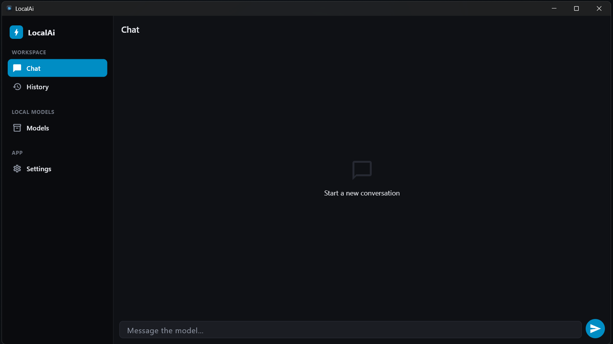
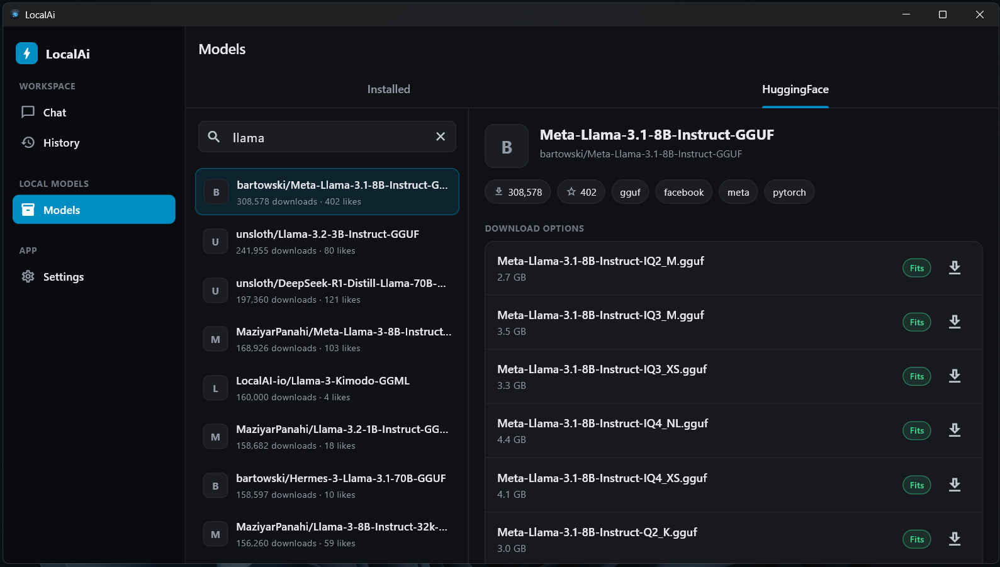
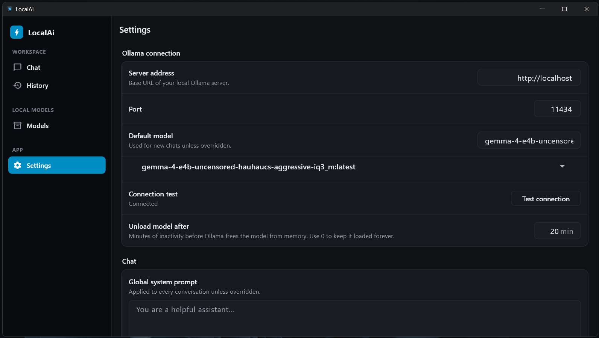

# LocalAi

**LocalAi** is a lightweight local first, offline AI chat client for Flutter. It talks to a
[Ollama](https://ollama.com) server (local or on your LAN) instead of a cloud API, so
conversations, model downloads, and inference all happen on hardware you control.

It runs today on **Windows** and **Android**, with a responsive adaptive shell that also
targets **Web**.

## Features

- **Offline-first chat**: streamed responses from any local Ollama model, with
  cancellable in-flight requests and a persistent conversation history stored in a local
  SQLite database (via [Drift](https://drift.simonbinder.eu/)).
- **Model library**: browse and search [Hugging Face](https://huggingface.co) for GGUF
  models, download them straight into Ollama, and manage what's already installed
  (list, delete one, or wipe all).
- **Hardware-aware recommendations**: detects total RAM, free disk, and GPU on the
  current device (Windows via WMI/PowerShell, Android via a native platform channel) and
  flags whether a given model comfortably **fits**, is **tight**, or is **too large**
  for your machine before you download it.
- **Adaptive UI shell**: a grouped sidebar navigation on desktop/tablet widths and a
  bottom navigation bar on phone widths, built with `go_router`'s
  `StatefulShellRoute.indexedStack` for instant, state-preserving tab switches.
- **Rich message rendering**: Markdown, syntax-highlighted code blocks, and sandboxed
  HTML block rendering inside chat bubbles.
- **Configurable inference settings**: system prompt, temperature, context length, and
  model keep-alive duration (how long Ollama keeps a model resident in memory).
- **Light/dark theming** that follows the system or can be pinned manually.

## Screenshots

<p align="center">
  
</p>
<p align="center">
  
  
</p>

## Architecture

The codebase follows a layered structure:

```
lib/
  core/        Cross-cutting concerns: DI (Riverpod providers), routing (go_router),
               theming, the adaptive shell, and shared utilities.
  data/        Concrete implementations: local Drift database, Ollama/Hugging Face
               HTTP clients, per-platform hardware detectors, model downloader.
  domain/      Business logic: entities, the InferenceEngine contract (OllamaEngine is
               the current implementation), repositories, and use cases such as the
               model-recommendation and content-block-parsing services.
  presentation/ Screens and controllers for chat, history, model library, and settings,
               organized by feature.
```

- **State management:** [Riverpod](https://riverpod.dev)
- **Routing:** [go_router](https://pub.dev/packages/go_router)
- **Local persistence:** [Drift](https://drift.simonbinder.eu/) (SQLite) +
  `flutter_secure_storage` for secrets
- **Networking:** [Dio](https://pub.dev/packages/dio)
- **Inference backend:** pluggable via the `InferenceEngine` interface: `OllamaEngine`
  is the only implementation today; an OpenAI-compatible remote engine and an embedded
  llama.cpp engine are planned.

## Prerequisites

- [Flutter SDK](https://docs.flutter.dev/get-started/install) 3.44.x or later
  (Dart SDK `^3.12.2`), on the **stable** channel.
- [Ollama](https://ollama.com/download) installed and running, reachable from the device
  you run LocalAi on (`http://localhost:11434` by default; set your device/LAN IP if
  running on a physical Android device against a desktop Ollama instance).
- Platform-specific tooling for whichever target you build:
  - **Windows:** Visual Studio 2022 with the "Desktop development with C++" workload.
  - **Android:** Android Studio with an installed SDK/NDK, or just the command-line
    tools (`flutter doctor` will tell you what's missing).
  - **Web:** `Experimental - Not tested` no extra tooling beyond Flutter's web support (`flutter config --enable-web`
    if it isn't already enabled).

Verify your setup:

```sh
flutter doctor
```

## Getting started

1. Install Ollama:

    - Windows `PowerShell`: 

        ```sh 
        irm https://ollama.com/install.ps1 | iex
        ```
    - Linux & macOS: 
        ```sh 
        curl -fsSL https://ollama.com/install.sh | sh
        ```

2. Clone the repository and fetch dependencies:

   ```sh
   git clone https://github.com/lazarus-muya/localai.git
   cd localai
   flutter pub get
   ```

3. Generate the Drift/Freezed/JSON-serializable code (required after a fresh clone, and
   any time you change a `@freezed`, `@JsonSerializable`, or Drift table definition):

   ```sh
   dart run build_runner build --delete-conflicting-outputs
   ```

   During active development, keep this running in watch mode instead:

   ```sh
   dart run build_runner watch --delete-conflicting-outputs
   ```

4. Make sure Ollama is running and reachable:

   ```sh
   ollama serve
   ```

5. Run the app on a connected device or emulator:

   ```sh
   flutter run
   ```

   Or target a specific platform:

   ```sh
   flutter run -d windows
   flutter run -d <android-device-id>   # see `flutter devices`
   ```

6. On first launch, open **Settings** and confirm the Ollama server URL/port point at
   your running instance, then use **Test connection** to verify connectivity. Pull a
   model from the **Models** tab (or via `ollama pull <model>` directly) before starting
   a chat.

## Build instructions

### Windows (desktop)

```sh
flutter build windows --release
```

Output: `build\windows\x64\runner\Release\` (contains `localai.exe` plus required DLLs
and the `data\` asset bundle: copy the whole folder to distribute).

### Android

```sh
# single binary - large apk size as it compiles for all arch
flutter build apk --release
# split binaries per arch - Recommended for smaller apk
flutter build apk --split-per-abi
# or, for Play Store distribution:
flutter build appbundle --release
```

Output: `build\app\outputs\flutter-apk\`

> The debug build signs with the debug keystore. For a release you intend to distribute,
> configure your own signing config in `android/app/build.gradle.kts` before building
> (see the `TODO` markers in that file).

### Web

```sh
flutter build web --release
```

Output: `build\web\`: serve it with any static file host. Note that a browser sandbox
cannot reach `localhost:11434` on a *different* machine than the one serving the page,
and Ollama's default config only listens on localhost: set `OLLAMA_HOST=0.0.0.0` on the
Ollama host and point LocalAi's server URL at that machine's LAN address if you need
cross-device access.

## Running tests

`Not implemented `

## Project configuration notes

- The Dart package name (`localai`), Android application ID
  (`com.localai.localai`), and Windows binary name (`localai.exe`) are internal build
  identifiers and are intentionally left unchanged from the app's user-facing name,
  **LocalAi**, which appears in the window title, Android launcher label, and web
  manifest/tab title.
- Local chat history is stored in a Drift/SQLite database on-device; nothing is synced
  to a remote service.

## Contributing

This project is under active development (see git history for the current phase). Run
`flutter analyze` and `flutter test` before opening a PR.

## License

Licensed under **AGPL-3.0 with the Commons Clause condition** — see [LICENSE](LICENSE).
In short: the source is public, you're free to use, study, modify, and redistribute it
(and any modified/hosted version must also publish its source), but **selling the
software or its source code, or offering it as a paid product/service, is not
permitted**. Contact the maintainer for a separate commercial license if you need rights
beyond this.
